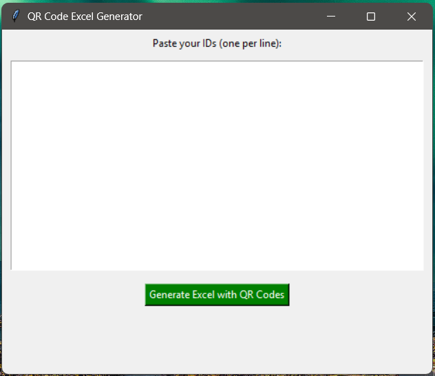

# 📦 QR Code Excel Generator (GUI-based)

This project automates the creation of QR code labels in an Excel sheet. It provides a clean, standalone GUI for non-technical users and is also highly customizable for developers.

---

## 💡 Features

- ✅ Paste up to 500+ unique IDs
- ✅ Automatically generates and embeds QR codes into Excel
- ✅ Resizes QR images to fit neatly in each row
- ✅ Standalone `.exe` for Windows – no installation needed
- ✅ User-friendly GUI – zero coding required

---

## 🖼️ App Screenshot



---

## 🚀 How to Run the App

### 🖥 For Windows Users (Non-technical)

1. Go to the [Releases page](https://github.com/ranafarooqhassan/QR_Code_Excel_Generator/releases)
2. Download `qr_gui_excel_generator.exe`
3. Paste your data (one ID per line)
4. Click “Generate Excel with QR Codes”
5. Your QR-embedded Excel file will be created!

---

### 👨‍💻 For Developers (Linux / Windows)

```bash
# Clone the repository
git clone https://github.com/ranafarooqhassan/QR_Code_Excel_Generator.git
cd QR_Code_Excel_Generator

# (Optional) Set up a virtual environment
python3 -m venv venv
source venv/bin/activate  # On Windows: venv\Scripts\activate

# Install dependencies
pip install -r requirements.txt

# Run the app
python qr_gui_excel_generator.py

---

📁 File Structure

QR_Code_Excel_Generator/
│
├── qr_gui_excel_generator.py # Main script
├── qr_gui_excel_generator.spec # PyInstaller spec file
├── qr_gui_excel_generator.exe # Standalone Windows executable
├── requirements.txt # Dependencies
├── README.md # Project documentation
├── build_windows_exe.bat # Windows build helper
├── install_linux_shortcut.sh # Linux launcher shortcut
└── app_screenshot.png # UI preview image

👤 Author

Farooq Hassan  
Senior IT Manager, Samman Group – Riyadh, KSA  
GitHub: [@ranafarooqhassan](https://github.com/ranafarooqhassan)
---
